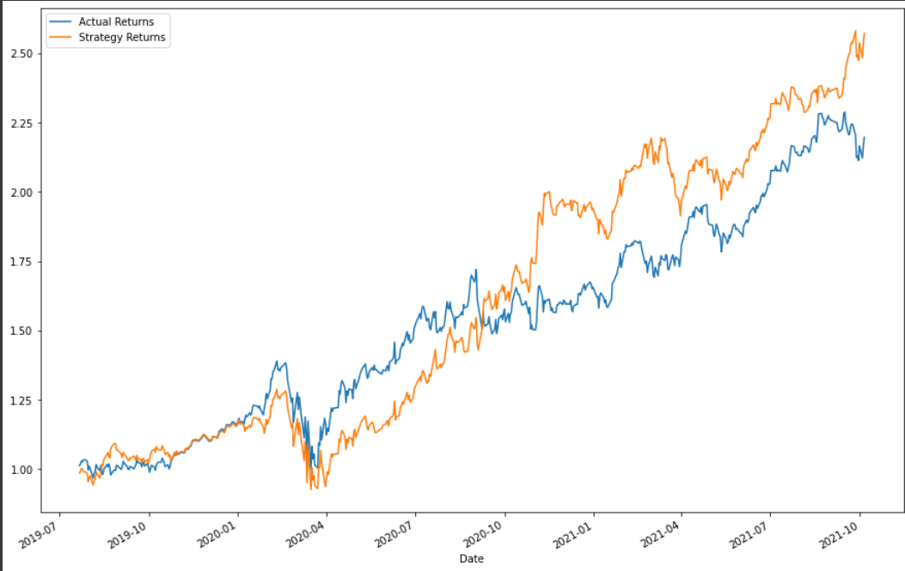
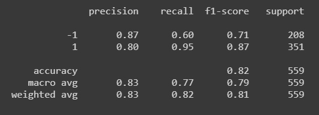
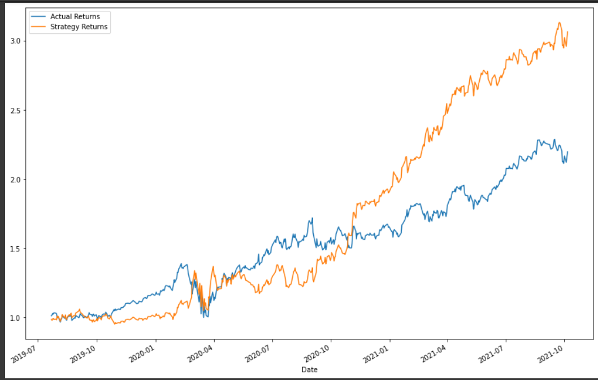
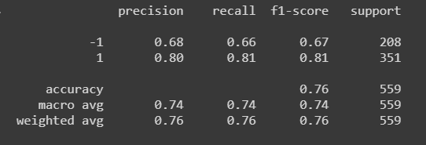
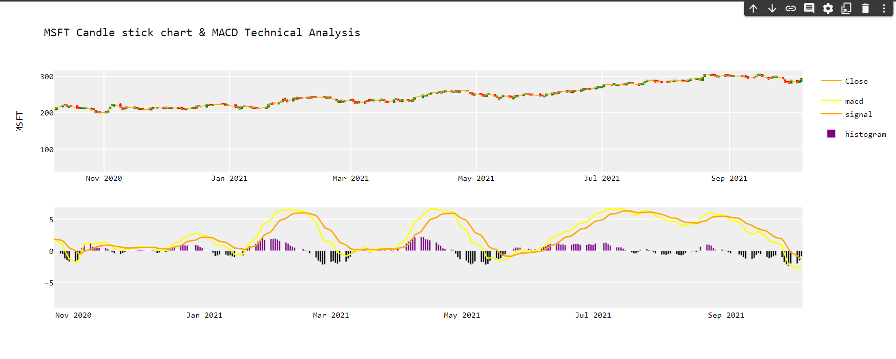
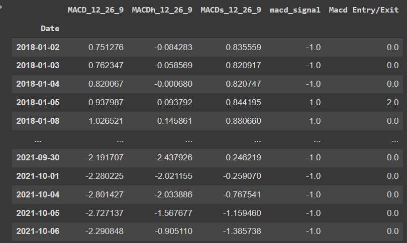

# Machine Learning: Automate your Success in Stocks
*Team Members: Anthony Barone, Alex Park, Bailey Richterman, & Dan Ladner*

## Overview
The goal of our financial application was to allow the user to tell us their specific goals and to use that information to help build a recommendation (buy, sell, hold, etc.)  for the user. 

How this relates to Machine Learning and FinTech:
* Used Ada Boost Classifier ML model
* Used Logistic Regression

Research Question:
* How well can we predict stock prices based on 3 thresholds of risk: low, moderate, high?
* Can different risk levels still use the ‘same’ machine learning model? 

## Instllations
```python
!pip install yfinance
!pip install pandas_ta
```

```python
import yfinance as yf
import pandas as pd
import matplotlib.pyplot as plt
import sys
import pandas_ta as pta

from sklearn import svm
from sklearn.preprocessing import StandardScaler
from pandas.tseries.offsets import DateOffset
from sklearn.metrics import classification_report
from plotly.subplots import make_subplots
import plotly.graph_objects as go
import numpy as np
```

## Examples of the application
**This example will walk through the analysis of the stock: "MSFT"**

### Logistic Regression




### Ada Boost Classifier




### Which ML model should I use?
The classification reports for logistic regression and ada boost classifier show a slight favorability towards logistic regression; however, for the chosen stock (Microsoft) we recommend using the Ada Boost Classifier model as it shows much greater difference in actual and strategy returns. 

### Candle Stick Chart and MACD Technical Analysis




### What do these graphs and charts mean?
These charts as well as the table shows the user if they should buy or sell the stock. Both show that the "MFST" stock should be sold (exit).

### Final Recommendation
Sell your Microsoft stock. 


